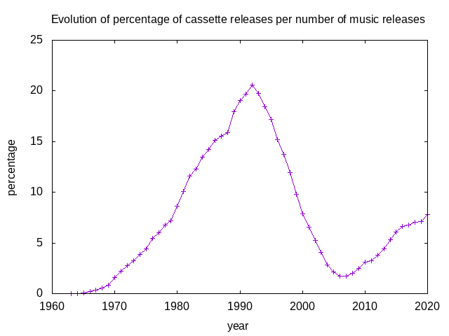

Are Cassette tapes dead? (again)

Tired of reading people saying that one or another mature technology was dead,
ten years ago I decided to act upon one of those claims (saying that cassette
tapes were dead) and [write a blog
post](https://mindboosternoori.blogspot.com/2011/05/stop-claiming-is-dead.html),
where, using the data available on Discogs, I made a graph showing the
percentage of cassette releases related to all of the releases on that
database.

That blog post had more success than I thought would have, with some people,
once in a while, wondering how were things progressing (not only regarding the
cassette tapes market on current days, but also the growth of discogs' database
and its knowledge of past releases). I did update the graph a few times since
the initial blog post, but today, to mark the 10th anniversary of the initial
post, I decided to [actually write a script that automatically generates such a
graphic](https://github.com/marado/discogs-tape-releases), and generate one of
those graphs, once again.

And, guess what!, turns out cassette tapes aren't dead, or even dying.

tags: discogs, stats, cassette, tape, compact cassette, music, data, software, music business, music market, en
